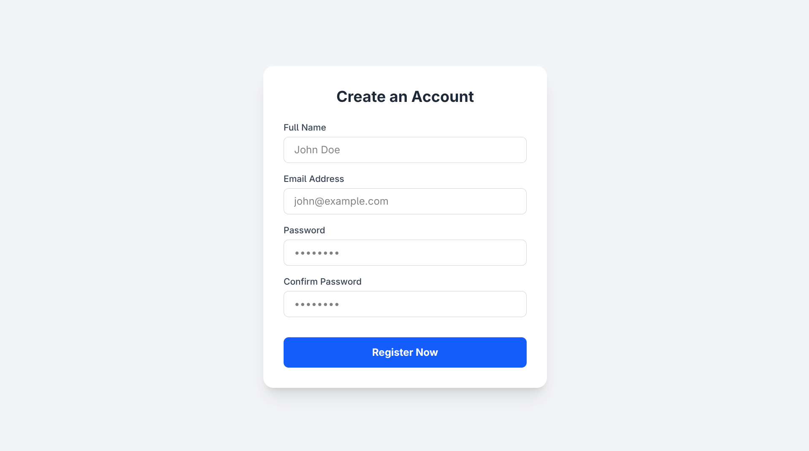

# Responsive Registration Form

A clean, modern, and fully responsive user registration form built as a practice project. It features client-side form validation and a custom toast notification system for an enhanced User Experience (UX), completely avoiding default browser alerts.

## ✨ Features
- **Client-Side Validation:** Real-time checking for name length, valid email format, and password matching.
- **Custom Toast Notification:** Smooth animated success message replacing the default `alert()`.
- **Mobile Responsive:** Perfectly adapts to desktop, tablet, and mobile screens.
- **Clean UI:** Styled modernly using Tailwind CSS with interactive elements (cursor pointers, hover states).
- **SEO Friendly:** Clean, semantic HTML structure.

## 🛠️ Tech Stack
- **HTML5**
- **Tailwind CSS** (via CLI)
- **Vanilla JavaScript**

## 🚀 How to Run Locally

1. Clone this repository or download the folder.
2. Open your terminal inside the project folder.
3. Run the following command to start the Tailwind CSS watcher:
   ```bash
   npm run dev
   ```
4. Open the index.html file in your browser (or use Live Server in VS Code) to view the project.
